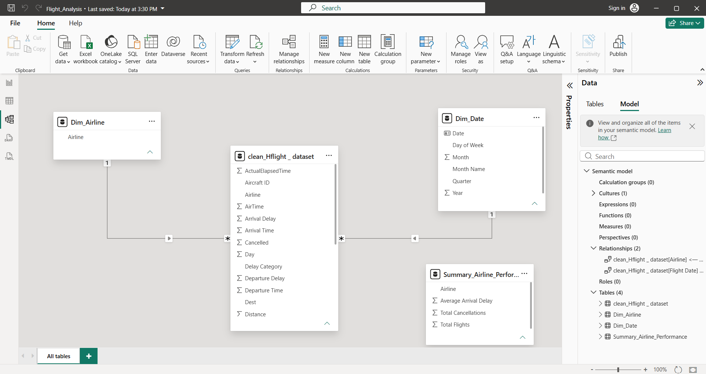
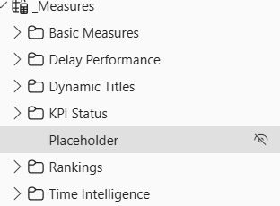
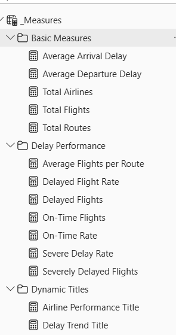
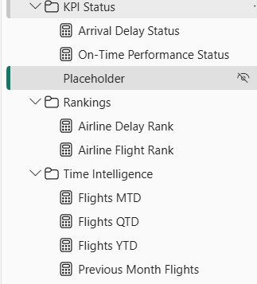

# Airline Delay and Operations Intelligence Dashboard

**Course:** DSA 3050A – Business Intelligence & Visualization
**Assessment:** Advanced Group Power BI Project
**Institution:** United States International University – Africa
**Topic selected:** Option 4 — Airline Delay and Operations Dashboard

---

## Group Name

**Grp05**

## Members and Student IDs

| Name | GitHub | Student ID |
|---|---|---|
| J. P. Chawanda | `@Jpchawanda` | 670444 |
| Catherine Ingabire | `@Catherine-20` | 671041|
| Ruth Musanhu | `@ruthmusanhu` | 670474|
| Faith Chakwanira | `@fai-alt` | 670435 |
| Racheal H. | `@HRacheal` | 670448 |
| Sharlyne K. | `@skiven-data` | 669718|


## Dataset Source

| | |
|---|---|
| **Dataset** | `hflights` — all commercial flights departing Houston, Texas in 2011 |
| **Primary source URL** | https://cran.r-project.org/package=hflights |
| **Original data owner** | US Department of Transportation, Bureau of Transportation Statistics — *Airline On-Time Performance* database |
| **BTS source URL** | https://www.transtats.bts.gov/Fields.asp?gnoyr_VQ=FGJ |
| **Licence** | Public domain (US federal government work), redistributed under GPL-2 in the R `hflights` package |

The data is genuine, publicly published government reporting. Nothing in this
repository is synthetic, generated or manually invented.

## Dataset Description

| Property | Value |
|---|---|
| Rows | **227,496** |
| Columns (raw) | **21** |
| Columns (cleaned) | **32** |
| Period covered | 1 January – 31 December 2011 |
| Origin airports | 2 — George Bush Intercontinental (**IAH**, 175,197 flights) and William P. Hobby (**HOU**, 52,299 flights) |
| Destination airports | 116 |
| Airlines | 15 |
| Distinct routes | 149 |
| Distinct aircraft (tail numbers) | 3,319 |
| Cancelled flights | 2,973 (1.31%) |
| Diverted flights | 649 (0.29%) |

**Files**

| File | What it is |
|---|---|
| [Dataset/hflights_raw.xlsx](Dataset/hflights_raw.xlsx) | Original source workbook as downloaded |
| [Dataset/raw_dataset.csv](Dataset/raw_dataset.csv) | Raw extract, unmodified — 227,496 × 21 |
| [Dataset/cleaned_dataset.csv](Dataset/cleaned_dataset.csv) | Output of the Power Query pipeline — 227,496 × 32 |
| [Dataset/dim_airline.csv](Dataset/dim_airline.csv) | Carrier-code lookup used by the merge step |
| [Dataset/dim_date.csv](Dataset/dim_date.csv) | Generated 2011 calendar table |

Raw columns: `Year, Month, DayofMonth, DayOfWeek, DepTime, ArrTime, UniqueCarrier,
FlightNum, TailNum, ActualElapsedTime, AirTime, ArrDelay, DepDelay, Origin, Dest,
Distance, TaxiIn, TaxiOut, Cancelled, CancellationCode, Diverted`

Every column is defined in full in
[Documentation/Data_Dictionary.pdf](Documentation/Data_Dictionary.pdf).

---

## Business Problem

Flight delays are the single largest controllable cost in airport and airline
operations. Every delayed departure burns extra fuel while taxiing, pushes crews
towards duty-hour limits, forces gate and stand reallocation, breaks passenger
connections, and — beyond a threshold — triggers compensation and rebooking costs.
A cancelled flight destroys the entire revenue of that rotation and displaces
passengers onto later services that are already full.

Houston's two airports handled 227,496 departures in 2011, and **47.8% of the
flights that actually operated arrived late**. Operations management could see
*that* the network was late, but not *where the lateness was being created* — it
was not visible whether the problem sat with particular carriers, particular
routes, particular times of day, or particular months. Without that attribution,
mitigation spending is guesswork.

**The problem this project solves:** turn a year of raw flight records into a
decision tool that attributes delay and cancellation to the specific carrier,
route, airport, hour and season that produced it, so that operational
interventions can be aimed at the few places where they will actually move the
on-time rate.

## Target Organization / Industry

**Industry:** Commercial aviation — airport and airline operations.

**Target organization:** The **Operations Performance team of the Houston Airport
System**, the municipal authority that runs both IAH and HOU, together with the
network operations centres of its two dominant carriers.

The dashboard is written for three audiences inside that organization:

| Audience | Decision the dashboard supports |
|---|---|
| **Airport Chief Operating Officer** | Where to direct capital and staffing to raise the system-wide on-time rate |
| **Airline network planners** | Which routes and departure banks need schedule padding or re-timing |
| **Duty operations managers** | Which carriers and periods need day-of-operation contingency cover |

## Key Business Questions

1. Which airlines have the highest delays, and does poor punctuality concentrate in the carriers that fly the most?
2. Which routes are the most delayed, and are they delayed enough to justify re-timing?
3. How do the two Houston airports compare on departure delay, arrival delay and taxi-out time?
4. What causes cancellations, how are those causes distributed through the year, and how much of the total is avoidable?
5. How does delay trend by month and season, and when is the network most fragile?
6. What are the peak travel periods, and does traffic volume by itself explain delay?
7. Does the time of day a flight is scheduled predict how late it will be?
8. How much departure delay do carriers recover in the air before arrival?

---

## Power Query Transformations

Every step below is an Applied Step in the Power Query Editor of
`GroupProject.pbix`. The exported result is
[Dataset/cleaned_dataset.csv](Dataset/cleaned_dataset.csv), which can be checked
against the model at any time.

### Required cleaning tasks

| # | Task | What was done |
|---|---|---|
| 1 | **Rename unclear columns** | `DayofMonth`→`Day`, `UniqueCarrier`→`Airline Code`, `FlightNum`→`Flight Number`, `TailNum`→`Aircraft ID`, `ActualElapsedTime`→`Elapsed Time`, `AirTime`→`Air Time`, `ArrDelay`→`Arrival Delay`, `DepDelay`→`Departure Delay`, `Origin`→`Origin Airport`, `Dest`→`Destination Airport`, `Distance`→`Distance (Miles)`, `TaxiIn`→`Taxi In`, `TaxiOut`→`Taxi Out` |
| 2 | **Correct data types** | Delay, taxi and elapsed-time columns forced from decimal to whole number; `Flight Date` built as a true Date; airport, carrier and aircraft codes set to Text; flag columns converted from 0/1 numerics to Yes/No text |
| 3 | **Remove duplicates and blank rows** | `Table.Distinct` across all columns. The source proved to be clean — 0 duplicate rows and 0 fully blank rows were removed. This was verified rather than assumed |
| 4 | **Trim and clean text columns** | `Text.Trim` + `Text.Upper` applied to `Airline Code`, `Aircraft ID`, `Origin`, `Dest` and `CancellationCode` to eliminate padding and case drift |
| 5 | **Replace inconsistent values** | Cancellation codes `A/B/C/D` replaced with `Carrier / Weather / National Air System / Security`; `Cancelled` and `Diverted` 0/1 flags replaced with `No/Yes` |
| 6 | **Handle missing values** | 795 null `Aircraft ID` values replaced with `"Unknown"`. The 224,523 null `CancellationCode` values are null *by design* (the flight was not cancelled) and were mapped to `"Not Cancelled"` rather than deleted. The 3,622 null `Arrival Delay` values belong to cancelled and diverted flights and were deliberately **left null** — imputing them would corrupt every delay average, so they are excluded by the DAX instead |
| 7 | **Remove unnecessary columns** | `Year` (constant 2011), and the raw `DepTime`, `ArrTime`, `Cancelled`, `Diverted`, `CancellationCode` columns dropped once their decoded replacements existed |
| 8 | **Split and merge columns** | `DepTime`/`ArrTime` **split** from HHMM integers into real `HH:MM` clock text plus a numeric `Departure Hour`; `Origin Airport` and `Destination Airport` **merged** into a single `Route` key |
| 9 | **Custom and conditional columns** | `Flight Status`, `Delay Category`, `Distance Band`, `Time of Day`, `Season`, `Delay Recovered` (see below) |
| 10 | **Extract date parts** | `Month`, `Month Name`, `Quarter`, `Day`, `Day of Week` derived from `Flight Date` |

### Advanced Power Query tasks (8 of the required 6 completed)

| Task | Where |
|---|---|
| **Merge queries using a common key** | `Dim_Airline` merged into the fact table on `Airline Code` to attach readable carrier names |
| **Create a date table** | `Dim_Date` generated over 2011-01-01 → 2011-12-31 with Year, Month, Month Name, Quarter, Day, Day of Week, Week of Year and Is Weekend |
| **Group By with multiple aggregations** | `Summary_Airline_Performance` built with Group By on `Airline`, aggregating Total Flights, Average Arrival Delay and Total Cancellations in one step |
| **Create summarized tables** | Same as above — a pre-aggregated carrier table that keeps the ribbon and ranking visuals off the 227k-row fact table |
| **Business categories using nested conditions** | `Delay Category` (5 bands), `Flight Status` (4 states), `Distance Band` (4 bands) and `Time of Day` (4 bands) are all nested `if/else if` chains |
| **Create reference queries** | `Dim_Airline` and `Summary_Airline_Performance` are reference queries off the cleaned fact query, so a change upstream flows to both |
| **Use column profiling** | Column quality and distribution enabled across the whole table, at 227,496 rows rather than the default 1,000-row sample — this is what surfaced the 98.69% null rate on `CancellationCode` (see [Screenshots/column_profiling.png](Screenshots/column_profiling.png)) |
| **Remove or handle errors** | `try … otherwise null` wrapped around the HHMM→time conversion so that the `2400` values present in `DepTime`/`ArrTime` roll to `00:00` instead of throwing |

### Derived business columns

| Column | Rule |
|---|---|
| `Flight Status` | `Cancelled` → `Diverted` → `On Time` if Arrival Delay ≤ 0 → otherwise `Delayed` |
| `Delay Category` | ≤0 On Time / Early · 1–14 Minor · 15–59 Moderate · 60–179 Severe · 180+ Extreme · null Not Completed |
| `Distance Band` | <500 Short Haul · 500–999 Medium Haul · 1000–1499 Long Haul · 1500+ Extended Haul |
| `Time of Day` | 00–05 Night · 06–11 Morning · 12–17 Afternoon · 18–23 Evening |
| `Season` | Dec–Feb Winter · Mar–May Spring · Jun–Aug Summer · Sep–Nov Autumn |
| `Delay Recovered` | `Departure Delay − Arrival Delay` — minutes clawed back in the air |
| `Route` | `Origin Airport` & "-" & `Destination Airport` |

**Evidence:** [raw_data.png](Screenshots/raw_data.png) ·
[column_profiling.png](Screenshots/column_profiling.png) ·
[cleaned_data.png](Screenshots/cleaned_data.png)

---

## Data Model

The model is a **star schema** built on one fact table and three dimensions, with
a disconnected table holding the measures.



| Table | Role | Grain / contents |
|---|---|---|
| **Fact_Flights** | Fact | One row per flight — 227,496 rows, 32 columns |
| **Dim_Date** | Dimension | One row per calendar day of 2011 (365 rows). Marked as the model's official date table |
| **Dim_Airline** | Dimension | One row per carrier (15 rows) — `Airline Code`, `Airline` |
| **Summary_Airline_Performance** | Aggregate | One row per carrier — pre-computed Total Flights, Average Arrival Delay, Total Cancellations |
| **_Measures** | Disconnected | Holds all DAX measures; contains no data of its own |

### Relationships

| From | To | Cardinality | Direction | Key |
|---|---|---|---|---|
| `Fact_Flights[Flight Date]` | `Dim_Date[Date]` | Many-to-one | Single | Date |
| `Fact_Flights[Airline]` | `Dim_Airline[Airline]` | Many-to-one | Single | Airline |
| `Summary_Airline_Performance[Airline]` | `Dim_Airline[Airline]` | Many-to-one | Single | Airline |

### Design decisions

- **No flat table.** The raw extract is one wide denormalised table; carrier and
  calendar attributes were lifted out into dimensions so that slicers filter the
  fact table through the dimension rather than over 227,496 rows of repeated text.
- **Single-direction filters throughout.** No bi-directional relationships, so
  there is no ambiguity in the filter path and no chance of a circular dependency.
- **A real date table.** `Dim_Date` is a contiguous 365-day calendar marked with
  *Mark as date table*, which is what makes `TOTALYTD`, `DATESQTD`,
  `DATESMTD` and `PREVIOUSMONTH` valid.
- **Measures isolated.** All measures live in `_Measures`, a table with no
  relationships and no columns, so the field list stays readable and measures are
  never confused with data.
- **An aggregate table where it pays.** `Summary_Airline_Performance` serves the
  carrier ranking and ribbon visuals from 15 rows instead of 227,496.

---

## DAX Measures

**22 named measures** are organised into six display folders inside `_Measures`,
plus one helper measure (`Completed Flights`) used as the shared denominator for
every rate.





### Basic aggregation

```dax
Total Flights = COUNTROWS ( Fact_Flights )

Total Airlines = DISTINCTCOUNT ( Fact_Flights[Airline] )

Total Routes = DISTINCTCOUNT ( Fact_Flights[Route] )

Average Arrival Delay = AVERAGE ( Fact_Flights[Arrival Delay] )

Average Departure Delay = AVERAGE ( Fact_Flights[Departure Delay] )
```

### Delay performance — percentage and ratio

```dax
Delayed Flights =
CALCULATE ( COUNTROWS ( Fact_Flights ), Fact_Flights[Flight Status] = "Delayed" )

On-Time Flights =
CALCULATE ( COUNTROWS ( Fact_Flights ), Fact_Flights[Flight Status] = "On Time" )

Severely Delayed Flights =
CALCULATE ( COUNTROWS ( Fact_Flights ), Fact_Flights[Arrival Delay] >= 60 )

Completed Flights =
CALCULATE ( COUNTROWS ( Fact_Flights ), NOT ISBLANK ( Fact_Flights[Arrival Delay] ) )

On-Time Rate      = DIVIDE ( [On-Time Flights], [Completed Flights] )
Delayed Flight Rate = DIVIDE ( [Delayed Flights], [Completed Flights] )
Severe Delay Rate = DIVIDE ( [Severely Delayed Flights], [Completed Flights] )

Average Flights per Route = DIVIDE ( [Total Flights], [Total Routes] )
```

Every rate divides by **completed** flights, not by all flights — a cancelled
flight is neither on time nor delayed, and including it in the denominator would
understate punctuality.

### Time intelligence

```dax
Flights MTD = TOTALMTD ( [Total Flights], Dim_Date[Date] )
Flights QTD = TOTALQTD ( [Total Flights], Dim_Date[Date] )
Flights YTD = TOTALYTD ( [Total Flights], Dim_Date[Date] )

Previous Month Flights =
CALCULATE ( [Total Flights], PREVIOUSMONTH ( Dim_Date[Date] ) )
```

### Ranking

```dax
Airline Delay Rank =
RANKX ( ALL ( Dim_Airline[Airline] ), [Average Arrival Delay], , DESC, DENSE )

Airline Flight Rank =
RANKX ( ALL ( Dim_Airline[Airline] ), [Total Flights], , DESC, DENSE )
```

### Conditional KPI / status

```dax
On-Time Performance Status =
SWITCH (
    TRUE (),
    [On-Time Rate] >= 0.80, "Good",
    [On-Time Rate] >= 0.65, "Watch",
    "Needs Attention"
)

Arrival Delay Status =
SWITCH (
    TRUE (),
    [Average Arrival Delay] <= 5,  "Good",
    [Average Arrival Delay] <= 15, "Watch",
    "Needs Attention"
)
```

### Dynamic titles

```dax
Airline Performance Title =
"Airline Performance for " & SELECTEDVALUE ( Dim_Airline[Airline], "All Airlines" )

Delay Trend Title =
"Delay Trend for " & SELECTEDVALUE ( Dim_Date[Month Name], "All Months" ) & " 2011"
```

### Formatting conventions

- Rate measures are formatted as **Percentage, 1 decimal place**.
- Delay measures are formatted as **Whole number** with a `" min"` suffix.
- Count measures use a **thousands separator** and no decimals.
- Measure names use Title Case and never repeat their table name.

---

## Dashboard Pages

The report uses the **Corporate Blue** theme recommended for airline projects —
white/light-grey canvas, navy blue accent, sky blue and teal secondaries, and
orange/red reserved strictly for warning states.

### Page 1 — Executive Summary

The one-screen answer to "how did Houston perform in 2011".

| Element | Detail |
|---|---|
| KPI cards ×4 | Total Flights · On-Time Rate · Total Routes · Average Arrival Delay |
| Ribbon chart | Airline flight volume by month — rank changes between carriers are visible as the ribbons cross |
| Decomposition tree | Flight operations broken down interactively by airline → month → delay category |
| Pie chart | Flight distribution by delay category |
| Navigation | Buttons to every other page |

### Page 2 — Trend Analysis

| Element | Detail |
|---|---|
| Line chart | Average delay across the twelve months of 2011 |
| Slicers | Airline, month and delay-category slicers, synced with the other pages |
| Dynamic title | Driven by `Delay Trend Title`, so the heading names the current selection |

### Page 3 — Geographic & Route Analysis

| Element | Detail |
|---|---|
| Azure map | Flight volume by destination, bubble-sized by traffic |
| Matrix | Airline performance by month with conditional formatting — a delay heat map |
| Slicers | Airline and destination |

### Page 4 — Route Drill-through

**Not yet built.** This is the one required page still outstanding — see
[Outstanding work](#outstanding-work) below.

---

## Key Insights

Every figure below is computed from the 227,496 flights in the dataset.
Full working: [Documentation/Insights.pdf](Documentation/Insights.pdf).

### 1. Punctuality is inversely related to scale — the carriers that fly Houston most are the ones that run it late

ExpressJet (71,669 flights, 50.6% on time), Continental (69,373, 50.9%) and
Southwest (44,536, 53.6%) operate **82% of all Houston departures** and all three
sit at or below the 52.2% system average. Meanwhile American (69.7%), AirTran
(68.9%) and US Airways (67.3%) run 15+ points better on a combined 9,319 flights.
The system-wide on-time rate is therefore almost entirely a function of what three
carriers do; improving the other twelve cannot move it. This is not a
small-sample artefact — ExpressJet and Continental each fly enough that their
rates are stable to within a fraction of a point.

### 2. Delay is manufactured during the day, not inherited from the schedule

A flight scheduled to depart at **06:00 leaves on average exactly on time
(-0.0 min)**. The same network at **20:00 averages 25.5 minutes of departure
delay** — a 25-minute deterioration with no change in aircraft, crew or route.
Delay accumulates monotonically through the day as each late arrival becomes the
next late departure. The implication is that late-evening delay is not caused by
evening conditions; it is the morning's delay, compounded across four or five
rotations.

### 3. Cancellations are not a chronic problem — they are one week in February

Of 2,973 cancellations across the whole year, **1,108 (37.3%) fall in February
alone, and 929 of those are coded Weather**. February's cancellation rate is
**6.47% against a 1.31% annual average** — a five-fold spike driven by the
Texas ice storm of that month. Strip February out and the network cancels
**0.89%** of flights, which is a well-run operation. Treating cancellation as an
ongoing reliability problem would misdiagnose a single extreme weather event.

### 4. Carrier-controllable causes dominate every month except the storm

Excluding February, **Carrier** is the largest cancellation reason in 8 of the
remaining 11 months, totalling 1,032 cancellations against 723 for weather.
Weather cancellations are concentrated and unavoidable; carrier cancellations are
diffuse, persistent and — unlike weather — actionable. The headline "weather is
our biggest cause" (1,652 vs 1,202 for the full year) is an artefact of one month
and reverses once that month is removed.

### 5. IAH is operationally slower on the ground but still arrives earlier than HOU

IAH takes **16.9 minutes to taxi out against HOU's 9.1** — nearly double, as
expected from a large hub with long taxiways. Yet IAH averages **8.4 minutes of
departure delay against HOU's 12.8**, and arrives earlier (7.0 min vs 7.5 min).
HOU's shorter taxi time is being consumed by later pushbacks. The bottleneck at
HOU is at the gate, not on the taxiway — which points at turnaround process
rather than airfield capacity.

### 6. Delay peaks in late spring, not in summer or at Christmas

Average arrival delay runs from a low of **3.2 minutes in November** to a high of
**13.1 minutes in May** — a 4× swing — while on-time rate moves from 60.3% down to
41.0%. Notably, **July is the busiest month of the year (20,548 flights) yet only
the fourth-worst for delay**, and December — the month operations plan hardest
for — sits in the better half of the year at 5.0 minutes. Traffic volume alone
does not predict delay: the correlation between monthly flight count and monthly
average delay is **r = 0.33**, which accounts for barely a tenth of the variation
in delay. Something other than volume is driving the seasonal pattern.

### 7. Most delay is small, but a thin tail does the damage

**52.2%** of completed flights arrive on time or early and another **26.9%** are
under 15 minutes late — 79% of flights are effectively fine. The operational and
commercial damage sits in the **4.7% that arrive an hour or more late** (10,584
flights), of which **1,110 arrive over three hours late**. These are the flights
that break connections and trigger compensation. An average-delay target would
chase the harmless middle; a severe-delay target would attack the costly tail.

### 8. Two-thirds of departure delay is recovered in the air

Of flights that departed late, **64.9% arrived less late than they departed**, and
the network recovers **2.3 minutes on average** between wheels-up and gate-in.
Schedule padding is already absorbing a meaningful share of departure delay —
which means departure delay overstates the passenger-facing problem, and arrival
delay is the correct metric for service-level reporting.

---

## Recommendations

### 1. Target the three high-volume carriers, not the fifteen-carrier average

ExpressJet, Continental and Southwest control 82% of departures and all run below
average. Establish a joint on-time working group with these three specifically,
with a shared target of moving their combined on-time rate from ~51% to the 60%
already achieved by the mid-size carriers. Moving those three by nine points moves
the entire Houston system by roughly seven; moving all twelve remaining carriers
to perfection would move it by less than three. **Expected impact: the single
highest-leverage intervention available.**

### 2. Protect the morning bank and re-time the evening bank

Because delay compounds monotonically from 06:00 to 20:00, the cheapest minute to
save is the earliest one. Prioritise first-rotation aircraft for gate, tug and
crew resources, and add 10–15 minutes of turnaround buffer to aircraft entering
their fourth rotation of the day. Where an aircraft is already 20+ minutes down by
midday, swap the tail rather than let the delay propagate through the evening.

### 3. Fix HOU's turnaround, not its taxiways

HOU has half of IAH's taxi-out time yet 4.4 minutes *more* departure delay. Do not
spend on airfield capacity at HOU. Run a gate-level turnaround study — boarding
process, ground-handling staffing and pushback crew availability — since the
delay is being created between the aircraft arriving on stand and the doors
closing.

### 4. Report cancellations with February separated out

Publish cancellation performance as two numbers: a baseline excluding extreme
weather events (0.89%) and a weather-event line reported separately. The blended
1.31% figure hides a well-run operation behind one ice storm, and it drives the
wrong conclusion — that weather is the dominant cause, when carrier-controllable
cancellations are in fact more numerous in 8 of 11 normal months.

### 5. Change the operational target from average delay to severe-delay rate

79% of flights are already fine and 4.7% cause nearly all of the cost. Replace the
"average arrival delay" target with a **severe delay rate** (≥60 min) target of
under 3.5%, down from 4.7%. This aims resource at the 10,584 flights that break
connections instead of at the harmless 1-to-14-minute band, which is largely
noise and is already absorbed by schedule padding.

### 6. Load-plan for May, not for July

Seasonal contingency staffing is currently aligned to traffic volume, which peaks
in July. Delay peaks in May, when the network is 4× worse than November on a
lower flight count. Move reserve crew, standby aircraft and additional ramp
staffing into the April–June window and reduce the December over-provision, where
performance is already in the top third of the year.

---

## Contribution Summary

| Member | Contribution |
|---|---|
| J. P. Chawanda | Repository setup and structure, Power BI data model and relationships, DAX measure library, dashboard assembly |
| Catherine Ingabire | Dataset sourcing and validation, Power Query cleaning steps, column profiling |
| Ruth Musanhu | Derived business categories, date table, summary/aggregate table |
| Faith Chakwanira | Dashboard visual design, theme and layout, slicers and navigation |
| Racheal H. | Insight analysis, recommendations, project report and presentation |

> Each member should confirm and adjust their own row before submission — the
> examiner may ask any member to explain any part of the work.

---

## Repository Structure

```
DSA3050A_GroupProject_Grp05/
├── Dataset/
│   ├── hflights_raw.xlsx                     original source workbook
│   ├── raw_dataset.csv                       227,496 x 21, unmodified
│   ├── cleaned_dataset.csv                   227,496 x 32, post Power Query
│   ├── dim_airline.csv                       carrier lookup
│   └── dim_date.csv                          2011 calendar table
│
├── PowerBI/
│   ├── GroupProject.pbix                     the submission file
│   └── GroupProject_ExecSummary_TrendPages.pbix   pages pending merge
│
├── Screenshots/
│   ├── raw_data.png                          raw dataset preview
│   ├── column_profiling.png                  column quality profile
│   ├── cleaned_data.png                      cleaned dataset preview
│   ├── data_model.png                        star schema
│   ├── dax_measures.png                      measure list
│   ├── dax_measures_advanced.png             KPI, ranking, time intelligence
│   └── dax_measure_folders.png               measure folder organisation
│
├── Documentation/
│   ├── Project_Report.pdf
│   ├── Data_Dictionary.pdf
│   ├── Insights.pdf
│   ├── Presentation.pdf
│   └── figures/                              charts used in the reports
│
├── .gitignore
├── LICENSE
└── README.md
```

---

## Outstanding work

Recorded honestly so the team knows exactly what is left:

1. **Merge the two `.pbix` files into one.** `GroupProject.pbix` holds the
   Executive Summary and Geographic pages; `GroupProject_ExecSummary_TrendPages.pbix`
   holds the Trend Analysis page. Both carry the identical data model, so the
   visuals can be copy-pasted across. Only `GroupProject.pbix` should survive.
2. **Build Page 4 — Route Drill-through.** Required by the brief and not yet
   started. It should drill through from the map and matrix on Page 3 on the
   `Route` field.
3. **Add a custom tooltip page** for the carrier visuals.
4. **Capture one screenshot per finished dashboard page** from Power BI Desktop.
   The Power Query Editor and Applied Steps evidence is already covered by
   [Documentation/PowerQuery_Cleaning_Steps.docx](Documentation/PowerQuery_Cleaning_Steps.docx).
5. **Fill in student IDs** in the members table above.
6. **Reach 20 commits with 3+ per member** — the brief's collaboration threshold.

## Licence

Released under the MIT Licence — see [LICENSE](LICENSE).
